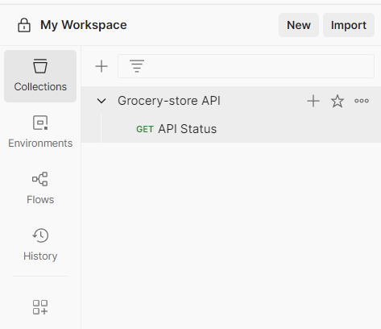
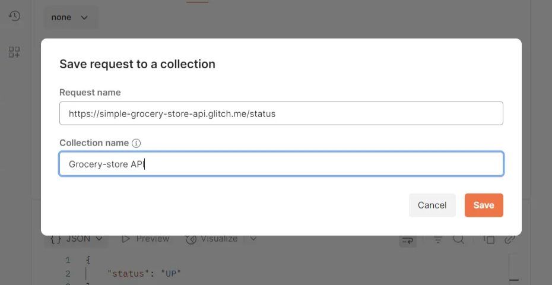

# Postman chapter1

- **🚅최종목표**
    
    Postman을 활용한 REST API 테스트 자동화 및 CI/CD 연동 이해를 통해 실무에서 사용할 수 있는 
    
    자동화 테스트 환경 구성 능력 습득
    
- 🔑**대표적인 요청 방법 4가지:**
    
    
    | 요청 방식 | 의미 | 예시 |
    | --- | --- | --- |
    | `GET` | 가져와줘 | 치킨 가게 목록 보기 |
    | `POST` | "새로 만들어!" | 리뷰 남기기 |
    | `PUT` | "정보 수정해!" | 메뉴 가격 바꾸기 |
    | `DELETE` | "정보 지워!" | 가게 삭제하기 |
- **🛒postman 요청 저장**
    
    postman에서 요청을 저장하려면 컬렉션에 붙여야함.
    
    컬렉션은 여러 요청을 저장하는 폴더 개념. 보통 API를 위한 컬렉션을 만들거나 우리가 가진 특정 사용사례를 위해 사용.
    
    
    
    
    
    1. **왜 Request name을 바꾸는가?** 
    
    기본적으로 postman에서 요청을 만들면 이름이 자동으로 untitled Request 처럼 됨. 
    하지만 **나중에 다시 확인하거나 수정하거나 테스트 자동화를 할 때 이름이 없으면 어떤 요청인지 기억하기 어려움.**
    
    | 이름 | 어떤 요청인지 알 수 있나? |
    | --- | --- |
    | ❌ Untitled Request | 뭐 하는 요청인지 모름 |
    | ✅ Get All Products | 제품 목록을 불러오는 요청임을 알 수 있음 |
    | ✅ Create New User | 새로운 사용자를 생성하는 요청임을 알 수 있음 |
    
    ➡️**즉 나중에 내가 이 요청을 봤을 때 직관적으로 무슨 역할을 하는지  알기 위해 이름을 바꾸는 것**
    
           QA 자동화에서는 요청 수십~수백 개가 될 수 있어서 이름 정리는 필수.
    
     ** 2. 왜 Collection(컬렉션)을 만드는가?**
    
    컬렉션은 여러 개의 요청을 **묶어서 관리**하는 폴더라고 생각하면 된다
    
    예시:
    
    📁 **User API 테스트 컬렉션**
    
    - GET /users
    - POST /users
    - DELETE /users/:id
    
    📁 **Product API 테스트 컬렉션**
    
    - GET /products
    - POST /products
    
    이렇게 모아두면:
    
    - 관련된 요청끼리 정리해서 보기 좋음
    - 나중에 **자동화 테스트 (collection runner, newman)** 할 때 **한 번에 실행**할 수 있음
- **👻테스트 대상 정보**
    
    
    | 항목 | 내용 |
    | --- | --- |
    | API URL | [https://api.example.com/login](https://api.example.com/login) |
    | 메서드 | POST |
    | 요청 형식 | JSON ({"email": "...", "password": "..."}) |
    | 인증 방식 | 없음 (토큰 발급 테스트) |
- **🧪실습 기록 (예: 로그인 API 테스트)**
    
    
    | 항목 | 내용 |
    | --- | --- |
    | 실습 주제 | 로그인 API 정상 작동 확인 |
    | 요청 주소 | `https://reqres.in/api/login` |
    | 메서드 | POST |
    | 요청 값 | `{ "email": "user@example.com", "password": "1234" }` |
    | 응답 기대값 | 200 OK + token |
    | 테스트 스크립트 | `pm.response.to.have.status(200)` |
    | 실제 결과 | ✅ 정상 토큰 발급됨 |
- **🥲요청실패**
    
    
    
    %20 은 공백이 있어서 오류가 났다는걸 알려줌 공백을 제거하고 다시 요청해야함.
    
    
    
    baseurl을 Grocery-store API collection에 저장했기때문에 새로운 탭을 열어 변수 baseurl로 API요청시 오류가 나게된다.
    
- 🧩**변수설정**
    
    ## **1.simple-grocery-store-api.glitch.me를 드래그 후 우클릭**
    
    
    
    ## **2.Find a variable에 변수이름 설정 ex) baseurl**
    
            **변수(Variable) 설정 이유**
    
    - 공통으로 사용하는 URL이나 비밀번호 등을 **한번만 정의하고 재사용**하기 위해 사용
    - 여러 환경(dev, test, prod)별로 쉽게 전환할 수 있음.
    - 민감한 정보(비밀번호, 토큰 등)를 **안전하게 관리 가능.**
    
    
    
    ## 3. 초기값 (Initial Value) vs 현재값 (Current Value)
    
    - **초기값**
        - 팀원과 공유되는 **기본값**으로 설정됨
    - **현재값**
        - 나 혼자만 쓰는 **로컬 전용 값**
        - 요청 시 **항상 현재값을 우선 사용**
    
    → 이렇게 구분하여 **협업용 기본값과 개인 실험용 값**을 안전하게 나눠 관리한다
    
    