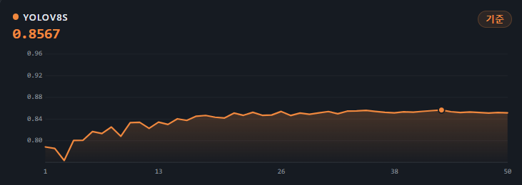
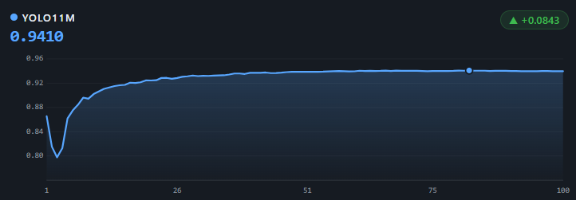
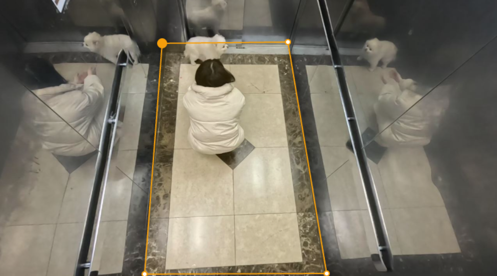

[← 프로필로 돌아가기](../README.md)

# CCTV 자동 어노테이션 시스템 (엘리베이터 제조사向)

> YOLO11 + SAM2 기반 수동 어노테이션 자동화 · 단독 개발 (기획·ML·Backend·Frontend)
> 계약 조건상 발주처명은 비공개이며, 업종만 표기합니다.

## 배경 & 목표

엘리베이터 CCTV 영상에서 사람·반려동물을 수동으로 라벨링하는 작업이 심각한 병목이었습니다. 수천 장 이상의 이미지에 사람이 직접 라벨을 붙이는 데 과도한 시간이 소요됐습니다.

- YOLO11 + SAM2 기반 웹 자동 어노테이션 플랫폼 구축
- 웹 UI에서 검토·보정한 어노테이션을 누적해 실시간 파인튜닝
- 프로젝트별 최적 모델을 선택해 추론 서버에 동적 로드

## 모델 개선

1차로 YOLO 단독(YOLO8 파인튜닝)으로 시도했으나 마스크가 부정확했습니다(예: 사람과 반려동물 마스크 겹침). 픽셀 수준 정밀도를 위해 SAM2를 도입해 **YOLO bbox → SAM2 마스크 정제** 파이프라인으로 전환했습니다.

| YOLO8 파인튜닝 (mAP50-95 0.86) | YOLO11 + SAM2 (mAP50-95 0.94) |
|:---:|:---:|
|  |  |

## 트러블슈팅 — 거울 반사 오탐지

엘리베이터 내부 거울에 비친 반려동물이 실제 객체로 인식되어 이중 탐지가 발생했습니다.

1. 하드코딩 좌표 — 거울 위치의 픽셀 좌표를 직접 지정해 해당 범위 탐지 무시
2. Y좌표 중복 제거 — 같은 Y좌표 대역에 bbox가 2개 이상 겹치면 하나를 제거
3. 2D 거리 기반 제거
4. **ROI 지정 방식 (최종 채택)** — 사용자가 웹 UI에서 실제 탐지 구역을 다각형으로 직접 지정

카메라 환경이 달라져도 ROI 재설정만으로 즉시 대응할 수 있는 구조로 일반화했습니다.

| 반사체 이중 탐지 (ROI 적용 전) | ROI 적용 후 |
|:---:|:---:|
|  |  |

웹 UI에서 다각형으로 실제 탐지 구역을 지정하는 ROI 설정 화면

## 성과

- 수동 어노테이션 대비 작업 속도 5배 향상
- 빠른 GT 생성 후 특정 도메인에 특화된 파인튜닝 모델 학습 가능
- ⚠️ 초기 mAP50 99.1%는 검증셋 무결성 문제로 부풀려진 수치였음을 이후 발견 —
  정정된 실제 성능(mAP50-95(B) 0.8366)과 발견 과정은
  [추론 최적화 & 검증셋 무결성](../ev_auto_pipeline/README.md#추론-최적화--검증셋-무결성) 참고

---

기술 상세 구현은 [ev_auto_pipeline 코드 저장소](../ev_auto_pipeline/)를 참고하세요.
