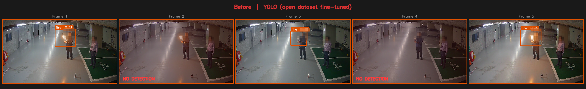
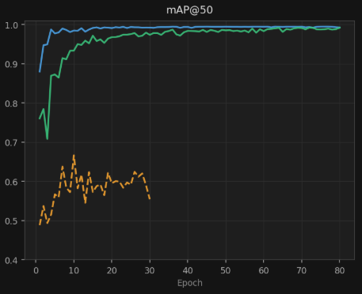

[← 프로필로 돌아가기](../README.md)

# CCTV 화재·연기 자동 어노테이션 (타이어 제조사向)

> 범용 CCTV 환경 화재·연기 소형 객체 탐지 자동화 · 단독 개발
> 계약 조건상 발주처명은 비공개이며, 업종만 표기합니다.

## 배경 & 목표

CCTV에서 보이는 불꽃·연기를 자동으로 어노테이트해야 했습니다. 실제 CCTV 영상에서 화재·연기는 이미지 면적의 1~5%에 불과한 소형 객체라 자동 어노테이션이 쉽지 않았습니다.

- 특정 카메라 환경에 종속되지 않는 일반화 성능이 핵심 목표
- 오픈 데이터셋 기반 YOLO 단독으로 탐지가 가능한지 검증
- SAM2 Video Tracking을 이용한 자동 어노테이트 성능 검증

## 문제 인식 — YOLO 파인튜닝의 한계

Roboflow 공개 데이터셋으로 YOLO를 파인튜닝했으나, 학습 데이터와 실촬영 환경의 bbox 크기 분포가 달라(도메인 갭) 실제 CCTV bbox 크기 기준 mAP가 0.6대에서 정체됐습니다.

불·연기는 구조적으로 같은 위치에서 연속 프레임에 걸쳐 확산되는 특성이 있습니다. 매 프레임 독립 탐지보다 시간축 연속성을 활용하는 비디오 트래킹이 적합하다고 판단했습니다.

## 최종 구조 — SAM2 Video Tracking

- **제로샷** — 파인튜닝 없이 임의 객체 추적 가능
- 첫 프레임 bbox 하나만 주면 이후 프레임 마스크가 자동 전파

| Before — YOLO(오픈 데이터셋 파인튜닝) 오탐·미탐 | After — SAM2 Video Tracking |
|:---:|:---:|
|  |  |

세 가지 학습 전략을 비교했습니다.

- Roboflow 공개 데이터 단독 파인튜닝 — 실제 CCTV bbox 크기와 달라 mAP 0.6 수준에서 정체
- EV 주차장 배경 Copy-Paste 합성 데이터 단독 학습 — mAP 수치는 빠르게 수렴하나 실환경 탐지 불안정
- **실제 촬영 영상 + 합성 데이터 통합 학습** — 가장 안정적으로 수렴

| mAP@50-95 | mAP@50 |
|:---:|:---:|
|  |  |

## 성과

- 불꽃·연기 같은 소형 객체 자동 어노테이트 가능
- 특정 카메라 환경에 종속되지 않는 자동 어노테이트 툴 개발 완료

---

기술 상세 구현은 [ev_auto_pipeline 코드 저장소](../ev_auto_pipeline/)를 참고하세요.
