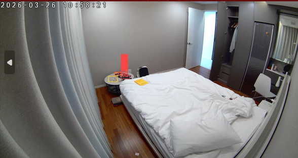
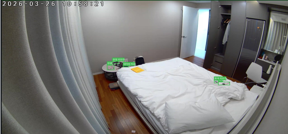

[← 프로필로 돌아가기](../README.md)

# CCTV 객체 위치 추론 파이프라인 (시니어 레지던스 AI 편의 서비스向)

> AI 비서용 GT 데이터 자동 생성 파이프라인 설계 및 VLM 통합 개발
> 코드 저장소는 비공개 계약 건으로 공개하지 않으며, 아래는 프로젝트 개요입니다.

## 배경 & 목표

시니어 레지던스 입주민 대상 AI 편의 서비스 개발을 위해, 침실·거실 고정 CCTV에서 지갑·스마트폰 등 생활 객체의 위치를 실시간으로 인식하는 시스템이 필요했습니다.

- GT 데이터 자동 생성 — 침실·거실 549개 폴더, 42,083건 위치분류를 수동 작업 없이 자동화
- VLM 환각 없는 안정적 추론
- AI 편의 서비스 학습용 고품질 GT 확보

## 문제 인식 — VLM 단독 추론의 한계

VLM에게 탐지 + 위치 분류 + bbox 생성을 동시에 요청했더니 다중 작업 과부하로 환각이 다수 발생하고, temperature를 낮춰도 프레임마다 결과가 달라지는 일관성 문제가 발생했습니다.

## 최종 구조 — 역할 분리

탐지는 CVAT 수동 bbox를 활용하고, VLM은 위치 분류만 전담하도록 역할을 분리했습니다. temperature=0, 단일 질문 구조로 전환.

| Before — VLM 단독 추론 (탐지+위치+bbox 동시 요청) | After — 역할 분리 (CVAT bbox + VLM 위치 분류만) |
|:---:|:---:|
|  |  |

같은 물건 주변에 라벨이 여러 개 겹쳐 붙던 문제(왼쪽)가, 역할 분리 후 단일 정확한 위치 분류(오른쪽)로 해결됐습니다.

## 성과

- 42,083건 위치 분류에서 **unknown 0건**, 100% 분류 성공
- ERGO-7B 등 비교 모델의 2~3배 과탐지 문제를 GT 대비 실측 실험으로 직접 검증
- 객체 위치 자동 분류 파이프라인 완성 — AI 편의 서비스 학습용 고품질 GT 확보
