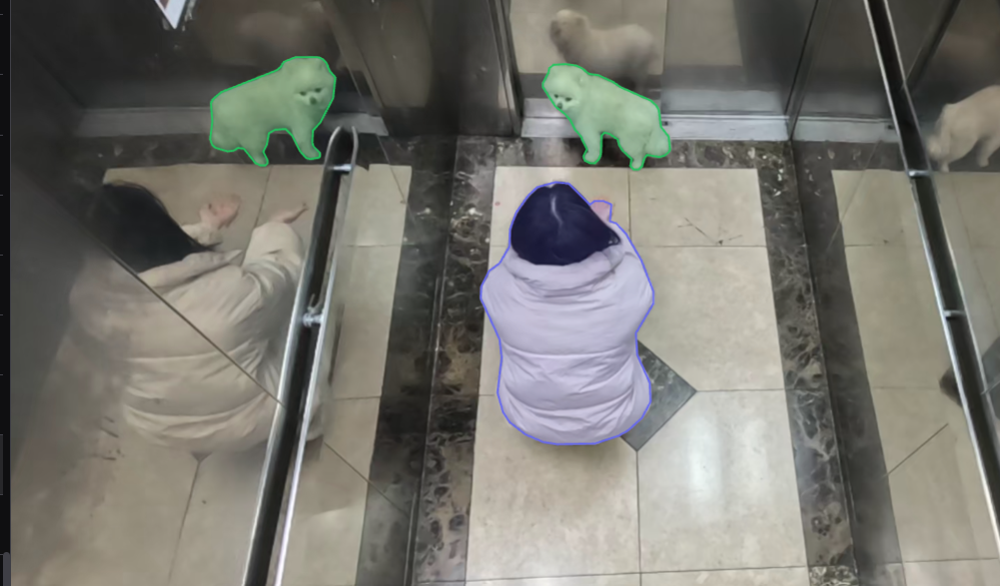
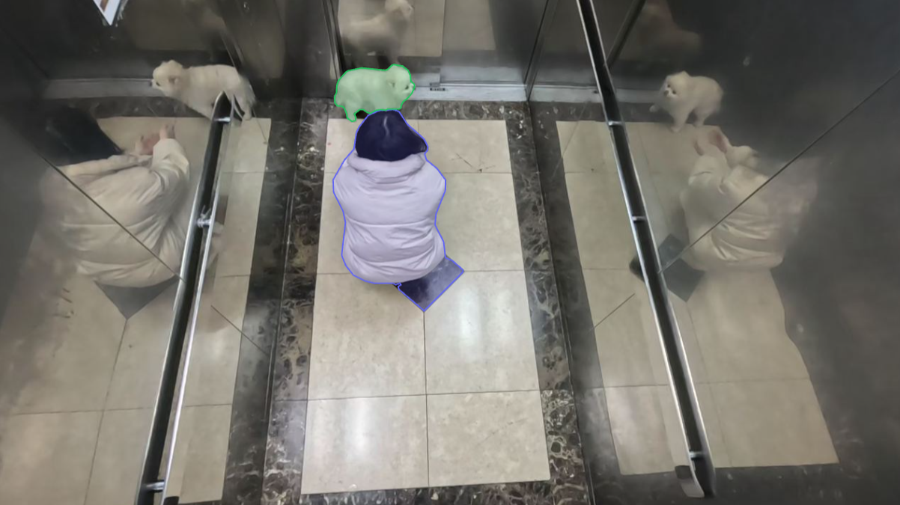
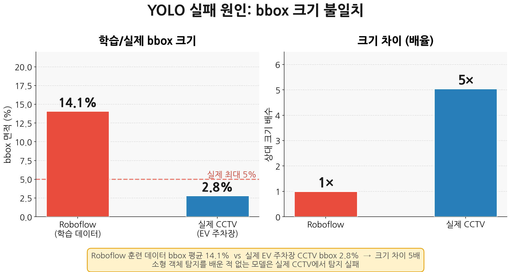
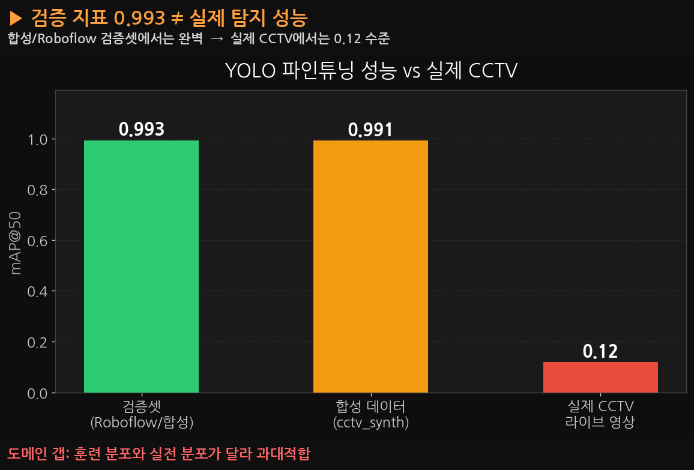
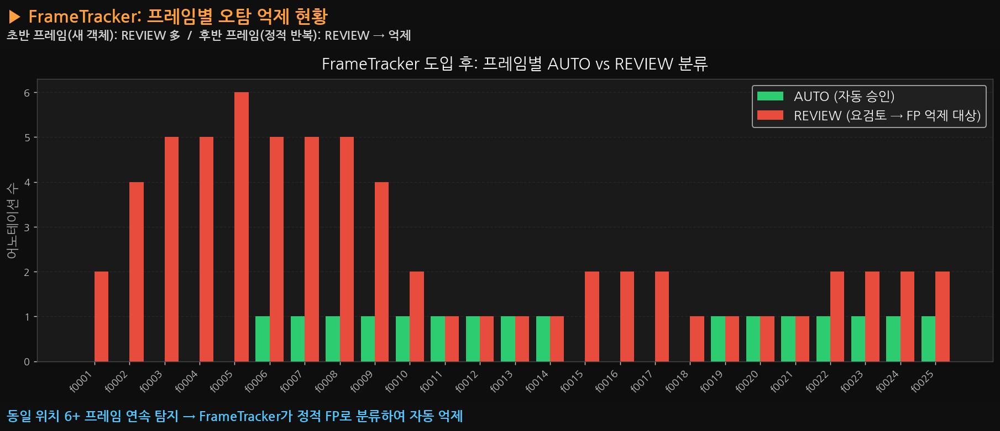

# EV 자동 어노테이션 시스템

> YOLO11 + SAM2 + Grounding DINO 기반 웹 자동 어노테이션 플랫폼
> CCTV 영상에서 객체를 자동으로 탐지·세그멘테이션하고, 검토된 결과를 다시 학습에 활용하는 파이프라인입니다.


---

## 포트폴리오 하이라이트

같은 파이프라인(YOLO11 + SAM2)을 서로 다른 두 CCTV 도메인에 적용하며 겪은 문제와 해결 과정입니다.
아래 사례의 발주처명은 비공개 계약 건으로, 업종만 표기했습니다.

### A. 엘리베이터 CCTV 자동 어노테이션 (엘리베이터 제조사向)

사람·반려동물을 수동으로 라벨링하던 작업을 YOLO11 + SAM2 파이프라인으로 자동화. 모델을 YOLO8 → YOLO11 + SAM2 조합으로 교체하며 mAP50-95를 0.86 → 0.94로 끌어올렸습니다.

| YOLO8 파인튜닝 (mAP50-95 0.86) | YOLO11 + SAM2 (mAP50-95 0.94) |
|:---:|:---:|
|  |  |

거울에 비친 반려동물이 실제 객체로 이중 탐지되는 문제는 좌표 하드코딩 → 중복 제거 → 거리 기반 필터를 거쳐, 결국 **사용자가 웹 UI에서 탐지 구역(ROI)을 직접 지정하는 방식**으로 해결했습니다. 카메라 설치 환경이 바뀌어도 ROI 재설정만으로 즉시 대응할 수 있습니다.

| 반사체 이중 탐지 (ROI 적용 전) | ROI 적용 후 |
|:---:|:---:|
|  |  |

<sub>웹 UI에서 다각형으로 실제 탐지 구역을 지정하는 ROI 설정 화면</sub>


**성과**: mAP50 99.1% · 수동 어노테이션 대비 작업 속도 5배 향상

### B. CCTV 화재·연기 자동 어노테이션 (타이어 제조사向)

공개 데이터셋(Roboflow)으로 YOLO를 파인튜닝했더니 검증셋 mAP50 0.99를 찍고도 실제 CCTV 영상에서는 거의 탐지하지 못했습니다. 원인은 **학습 데이터와 실촬영 환경의 bbox 크기 분포 불일치** — 학습 데이터는 화재/연기가 화면의 14%를 차지하는 근접 촬영 위주인데, 실제 CCTV는 광각 고정 카메라라 1~5%에 불과한 소형 객체였습니다.

| 학습 vs 실환경 bbox 크기 불일치 | 검증 지표 vs 실제 탐지 성능 |
|:---:|:---:|
|  |  |

이후 제로샷 탐지(Grounding DINO)로 전략을 전환하고, ROI 필터·SAM2 정밀 재계산·박스 병합에 더해 **FrameTracker**(동일 위치에서 6프레임 이상 연속 탐지되면 정적 오탐으로 자동 억제)를 적용해 소화기·조명 등의 반복 오탐을 걸러냈습니다.



**성과**: 특정 카메라 환경에 종속되지 않는 소형 객체(화재·연기) 자동 어노테이션 파이프라인 완성

---

## 주요 기능

| 기능 | 설명 |
|------|------|
| 자동 어노테이션 | YOLO11 탐지 + SAM2 세그멘테이션으로 배치 레이블링 |
| 제로샷 탐지 | Grounding DINO로 학습 없이 화재·연기 탐지 |
| 인터랙티브 SAM2 | 클릭(bbox/포인트) → 즉시 마스크 생성 |
| 비디오 트래킹 | SAM2 Video Predictor로 프레임 간 객체 전파 |
| ROI 필터 | 웹 UI에서 탐지 구역을 다각형으로 지정, 구역 밖 오탐 자동 제거 |
| 파인튜닝 | 어노테이션 데이터로 YOLO 모델 재학습 |
| 다중 포맷 내보내기 | YOLO / COCO / VOC / CSV |

## 기술 스택

**Backend**: FastAPI · SQLAlchemy · PostgreSQL · PyTorch 2.11 (CUDA 12.8)
**Frontend**: React 19 · TypeScript · Vite · Konva · Zustand · Tailwind CSS
**ML**: YOLO11 · SAM2 (Meta) · Grounding DINO (IDEA-Research)

## 아키텍처

```
[React SPA]  ←→  [FastAPI :8000]  ←→  [PostgreSQL :5432]
                      │
              [inference.py]
              ├── YOLO11  (GPU 2, cuda:0)
              ├── SAM2    (GPU 2, cuda:0)
              └── GDINO   (GPU 5, cuda:1)
```

GPU 구성: GPU 2 (YOLO+SAM2 추론) / GPU 5 (Grounding DINO) / GPU 3 (파인튜닝 학습)

## 빠른 시작

### 사전 요구사항

- Python 3.12 + venv
- Node.js 20+
- Docker (PostgreSQL 컨테이너)
- CUDA 12.8 호환 GPU

### 설치

```bash
git clone https://github.com/JunleeB/ev-auto-annotation.git
cd ev-auto-annotation

# Python 환경
python3.12 -m venv venv
venv/bin/pip install -r requirements.txt

# 프론트엔드
cd frontend && npm install && npm run build && cd ..

# SAM2 체크포인트 다운로드
mkdir -p checkpoints
# https://github.com/facebookresearch/sam2 에서 sam2.1_hiera_large.pt 다운로드
# → checkpoints/sam2.1_hiera_large.pt

# PostgreSQL (Docker) — 아래 값은 예시입니다. 반드시 직접 지정한 값으로 바꾸고
# backend/database.py의 DATABASE_URL(또는 DATABASE_URL 환경변수)도 동일하게 맞춰주세요
docker run -d --name ev_postgres \
  -e POSTGRES_DB=annotation \
  -e POSTGRES_USER=evuser \
  -e POSTGRES_PASSWORD=<your-password> \
  -p 5432:5432 \
  -v ./pgdata:/var/lib/postgresql/data \
  postgres:15
```

### 실행

```bash
# 프로덕션
CUDA_VISIBLE_DEVICES=2,5 ./start.sh

# 개발 (HMR)
CUDA_VISIBLE_DEVICES=2,5 ./start_dev.sh
```

접속: http://localhost:8000
최초 관리자 계정은 `backend/routers/auth.py`의 시딩 로직에서 처음 실행 시 자동 생성됩니다. 공개 저장소로 배포하기 전에 해당 로직의 기본 계정/비밀번호를 직접 값으로 교체하고, 첫 로그인 후에도 비밀번호를 변경하세요.

## 프로젝트 구조

```
ev-auto-annotation/
├── backend/
│   ├── main.py          # FastAPI 앱, 서버 초기화
│   ├── database.py      # SQLAlchemy ORM 모델
│   ├── inference.py     # YOLO + SAM2 + GDINO 추론 엔진
│   └── routers/         # auth / projects / images / annotations / jobs / models
├── frontend/
│   └── src/
│       ├── pages/       # Login / Projects / Annotator / Training / Admin
│       ├── store/       # Zustand 상태 관리
│       └── api/         # FastAPI 클라이언트
├── scripts/
│   ├── generate_cctv_fire_data.py   # Copy-Paste 합성 데이터 생성기
│   ├── train_fire_smoke.py          # YOLO 파인튜닝 스크립트
│   ├── train_fire_smoke.sh          # SLURM 배치 스크립트
│   └── migrate_to_pg.py            # SQLite → PostgreSQL 마이그레이션
├── datasets/                        # data.yaml 파일만 (이미지 제외)
├── docs/                            # 트러블슈팅 차트 및 리드미 이미지
├── start.sh
├── start_dev.sh
└── requirements.txt
```

## 문서

- [기술 설명서](docs/기술설명서.md) — 전체 아키텍처, API 목록, ML 파이프라인 상세

## 라이선스

Private repository — All rights reserved.
