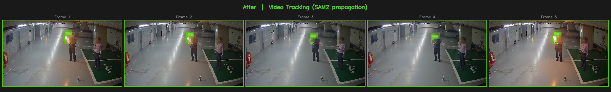
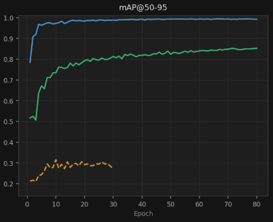

# EV 자동 어노테이션 시스템

> YOLO11 + SAM2 + Grounding DINO 기반 웹 자동 어노테이션 플랫폼
> CCTV 영상에서 객체를 자동으로 탐지·세그멘테이션하고, 검토된 결과를 다시 학습에 활용하는 파이프라인입니다.


---

## 포트폴리오 하이라이트

같은 파이프라인(YOLO11 + SAM2)을 서로 다른 두 CCTV 도메인에 적용하며 겪은 문제와 해결 과정입니다.
아래 사례의 발주처명은 비공개 계약 건으로, 업종만 표기했습니다.

<a name="project-a"></a>
### A. 엘리베이터 CCTV 자동 어노테이션 (엘리베이터 제조사向)

사람·반려동물을 수동으로 라벨링하던 작업을 YOLO11 + SAM2 파이프라인으로 자동화. 모델을 YOLO8 → YOLO11 + SAM2 조합으로 교체하며 mAP50-95를 0.86 → 0.94로 끌어올렸습니다.

| YOLO8 파인튜닝 (mAP50-95 0.86) | YOLO11 + SAM2 (mAP50-95 0.94) |
|:---:|:---:|
|  |  |

거울에 비친 반려동물이 실제 객체로 이중 탐지되는 문제는 좌표 하드코딩 → 중복 제거 → 거리 기반 필터를 거쳐, 결국 **사용자가 웹 UI에서 탐지 구역(ROI)을 직접 지정하는 방식**으로 해결했습니다. 카메라 설치 환경이 바뀌어도 ROI 재설정만으로 즉시 대응할 수 있습니다.

| 반사체 이중 탐지 (ROI 적용 전) | ROI 적용 후 |
|:---:|:---:|
|  |  |

<sub>웹 UI에서 다각형으로 실제 탐지 구역을 지정하는 ROI 설정 화면</sub>


**성과**: 수동 어노테이션 대비 작업 속도 5배 향상
> ⚠️ 초기 mAP50 99.1%는 검증셋 무결성 문제로 부풀려진 수치였습니다 — 상세 내용과 정정된 수치는 [아래 섹션](#추론-최적화--검증셋-무결성)을 참고하세요.

---

## 추론 최적화 & 검증셋 무결성

TensorRT 변환으로 추론 속도를 높이는 과정에서, 사용 중이던 검증셋 자체에
데이터 누수가 있다는 걸 발견하고 재구성했습니다. 상세 방법론/재현 코드는
[`benchmark/`](benchmark/) 참고.

### 결과

- PyTorch → TensorRT FP16: **9.90ms → 2.62ms (3.78배)**
- 이득 분해: 그래프 최적화 1.92배 × 정밀도 절감 1.97배 (mAP 손실 0.42%p, 클린 홀드아웃 기준)
- INT8 미채택 — 클린셋 기준 손실 3.26%p 대비 이득이 5~16% 범위로 불안정

### 검증 과정에서 발견한 것

- 데이터셋 분할 스크립트가 클립(영상) 단위가 아니라 **개별 프레임 단위**로 무작위 분할되어 있었음 — val 클립 238개 중 238개(100%)가 train에도 존재
- NAS의 미학습 클립 352개(20,791장)로 홀드아웃을 재구성해 재학습 없이 재평가
- **mAP50-95(B): 0.9408 → 0.8366** (실제 일반화 성능, -10.4%p)
- 클래스별로는 person -3.6%p, **dog -17.1%p** — dog는 샘플 수·자세 다양성 부족으로 일반화 대신 암기에 의존했을 가능성
- 누수된 검증셋은 INT8의 정확도 손실 폭도 약 3배 과소평가하고 있었음 (-1.13%p → 실제 -3.26%p)

| 지표 | leaky val | 클린 홀드아웃 | 차이 |
|---|---|---|---|
| mAP50-95(B) | 0.9408 | 0.8366 | -10.4%p |
| person | 0.983 | 0.947 | -3.6%p |
| dog | 0.898 | 0.727 | -17.1%p |

### 기각한 가설

- **"reformat 오버헤드가 원인"** — `--fp16` fallback을 추가해 재빌드했으나 dtype 재집계 결과 float16 텐서 0개, mAP도 완전 동일 → 근거 없음으로 기각
- **"그럼 속도차는 뭐였나"** — 동일 설정으로 재빌드해 재현성 검증 → TensorRT 빌드 간 커널 튜닝 변동성(노이즈)이었음을 확인

<a name="project-b"></a>
### B. CCTV 화재·연기 자동 어노테이션 (타이어 제조사向)

범용 CCTV 환경에서 화재·연기(이미지 면적 1~5%의 소형 객체)를 특정 카메라에 종속되지 않고 자동 탐지하는 것이 목표였습니다. 오픈 데이터셋(Roboflow) 기반 YOLO 파인튜닝을 시도했으나, 실제 CCTV의 bbox 크기 분포와 달라 mAP가 0.6대에서 정체되는 도메인 갭을 확인했습니다.

불·연기가 연속 프레임에 걸쳐 확산되는 시간축 특성에 주목해, 단일 프레임 독립 탐지 대신 **SAM2 Video Tracking**(제로샷 — 첫 프레임 bbox 하나만으로 이후 프레임 마스크 자동 전파)으로 전환했습니다.

| Before — YOLO(오픈 데이터셋 파인튜닝) 오탐·미탐 | After — SAM2 Video Tracking |
|:---:|:---:|
|  |  |

Roboflow 단독 학습, 합성데이터(EV 주차장 배경 Copy-Paste) 단독 학습, 실촬영+합성 통합 학습 3가지 전략을 비교한 결과 실촬영+합성 통합 학습이 가장 안정적으로 수렴했습니다.

| mAP@50-95 | mAP@50 |
|:---:|:---:|
|  |  |

**성과**: 특정 카메라 환경에 종속되지 않는 소형 객체(화재·연기) 자동 어노테이션 파이프라인 완성

---

## 주요 기능

| 기능 | 설명 |
|------|------|
| 자동 어노테이션 | YOLO11 탐지 + SAM2 세그멘테이션으로 배치 레이블링 |
| 제로샷 탐지 | Grounding DINO로 학습 없이 화재·연기 탐지 |
| 인터랙티브 SAM2 | 클릭(bbox/포인트) → 즉시 마스크 생성 |
| 비디오 트래킹 | SAM2 Video Predictor로 프레임 간 객체 전파 |
| ROI 필터 | 웹 UI에서 탐지 구역을 다각형으로 지정, 구역 밖 오탐 자동 제거 |
| 파인튜닝 | 어노테이션 데이터로 YOLO 모델 재학습 |
| 다중 포맷 내보내기 | YOLO / COCO / VOC / CSV |

## 기술 스택

**Backend**: FastAPI · SQLAlchemy · PostgreSQL · PyTorch 2.11 (CUDA 12.8)
**Frontend**: React 19 · TypeScript · Vite · Konva · Zustand · Tailwind CSS
**ML**: YOLO11 · SAM2 (Meta) · Grounding DINO (IDEA-Research)

## 아키텍처

```
[React SPA]  ←→  [FastAPI :8000]  ←→  [PostgreSQL :5432]
                      │
              [inference.py]
              ├── YOLO11  (GPU 2, cuda:0)
              ├── SAM2    (GPU 2, cuda:0)
              └── GDINO   (GPU 5, cuda:1)
```

GPU 구성: GPU 2 (YOLO+SAM2 추론) / GPU 5 (Grounding DINO) / GPU 3 (파인튜닝 학습)

## 빠른 시작

### 사전 요구사항

- Python 3.12 + venv
- Node.js 20+
- Docker (PostgreSQL 컨테이너)
- CUDA 12.8 호환 GPU

### 설치

```bash
git clone https://github.com/JunleeB/vision-engineering.git
cd vision-engineering/ev_auto_pipeline

# Python 환경
python3.12 -m venv venv
venv/bin/pip install -r requirements.txt

# 프론트엔드
cd frontend && npm install && npm run build && cd ..

# SAM2 체크포인트 다운로드
mkdir -p checkpoints
# https://github.com/facebookresearch/sam2 에서 sam2.1_hiera_large.pt 다운로드
# → checkpoints/sam2.1_hiera_large.pt

# PostgreSQL (Docker) — 아래 값은 예시입니다. 반드시 직접 지정한 값으로 바꾸고
# backend/database.py의 DATABASE_URL(또는 DATABASE_URL 환경변수)도 동일하게 맞춰주세요
docker run -d --name ev_postgres \
  -e POSTGRES_DB=annotation \
  -e POSTGRES_USER=evuser \
  -e POSTGRES_PASSWORD=<your-password> \
  -p 5432:5432 \
  -v ./pgdata:/var/lib/postgresql/data \
  postgres:15
```

### 실행

```bash
# 프로덕션
CUDA_VISIBLE_DEVICES=2,5 ./start.sh

# 개발 (HMR)
CUDA_VISIBLE_DEVICES=2,5 ./start_dev.sh
```

접속: http://localhost:8000
최초 관리자 계정은 `backend/routers/auth.py`의 시딩 로직에서 처음 실행 시 자동 생성됩니다. 공개 저장소로 배포하기 전에 해당 로직의 기본 계정/비밀번호를 직접 값으로 교체하고, 첫 로그인 후에도 비밀번호를 변경하세요.

## 프로젝트 구조

```
ev-auto-annotation/
├── backend/
│   ├── main.py          # FastAPI 앱, 서버 초기화
│   ├── database.py      # SQLAlchemy ORM 모델
│   ├── inference.py     # YOLO + SAM2 + GDINO 추론 엔진
│   └── routers/         # auth / projects / images / annotations / jobs / models
├── frontend/
│   └── src/
│       ├── pages/       # Login / Projects / Annotator / Training / Admin
│       ├── store/       # Zustand 상태 관리
│       └── api/         # FastAPI 클라이언트
├── benchmark/            # TensorRT 최적화 + 검증셋 무결성 재현 코드
│   ├── export_onnx.py
│   ├── build_engine.py
│   ├── benchmark.py
│   ├── evaluate.py
│   ├── calibration_loader.py
│   ├── check_split_leakage.py
│   └── README.md
├── train.py                        # YOLO11-seg 파인튜닝 스크립트
├── find_mirror_zone.py             # 거울 반사 ROI 좌표 탐색 도구
├── auto_label.py / test_label.py   # 독립 실행형 YOLO+SAM2 라벨링 스크립트
├── migrate_to_pg.py                # SQLite → PostgreSQL 마이그레이션
├── docs/                            # 트러블슈팅 차트 및 리드미 이미지
├── start.sh
├── start_dev.sh
└── requirements.txt
```

## 라이선스

TODO: 라이선스 미지정. 포트폴리오 공개 목적이면 MIT 등으로 명시 필요.
