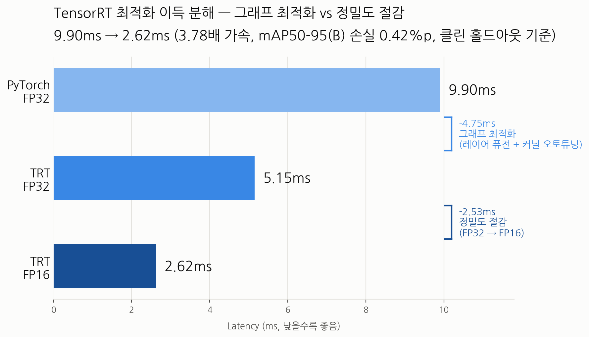

# TensorRT 추론 최적화 — 상세 방법론

상위 프로젝트: [엘리베이터 CCTV 자동 어노테이션 시스템](../README.md)

전체 과정 요약은 상위 README를 참고하고, 여기서는 각 단계의 실행 방법과
측정 방법론을 상세히 다룬다.

## 0. Baseline 재현

TensorRT 변환 전에, 기존 학습 로그의 mAP가 지금 환경에서도 재현되는지 먼저
확인한다. 이게 없으면 이후 모든 수치 변화가 "정밀도 때문인지 환경이 깨진
건지" 구분이 안 된다.

```bash
python evaluate.py --model best.pt --data dataset.yaml --task segment
```

## 1. ONNX Export

```bash
python export_onnx.py --model best.pt --imgsz 640
```

`dynamic=True`로 export해야 이후 배치 크기를 바꿔가며 엔진을 빌드할 수
있다. 정적(static) ONNX로 export하면 나중에 배치 실험에서
`Input dimensions ... but profile dimensions ...` 에러가 난다.

## 2. FP32 / FP16 엔진 빌드 + 벤치마크

```bash
python build_engine.py --onnx best.onnx --precision fp32 --out best_fp32.engine
python build_engine.py --onnx best.onnx --precision fp16 --out best_fp16.engine

python benchmark.py --engine best_fp32.engine
python benchmark.py --engine best_fp16.engine

python evaluate.py --model best_fp32.engine --data dataset.yaml --task segment
python evaluate.py --model best_fp16.engine --data dataset.yaml --task segment
```

`trtexec`는 pip 배포판에 포함되지 않아 `polygraphy`로 대체했다
(`build_engine.py`/`benchmark.py`가 내부적으로 호출).

### 결과 — 이득 분해

| 설정 | mean latency | 빌드시간 | 엔진 크기 |
|---|---|---|---|
| PyTorch FP32 | 9.90ms | — | — |
| TRT FP32 | 5.15ms | 95.1s | 105 MiB |
| TRT FP16 | 2.62ms | 310.6s | 46 MiB |

- PyTorch FP32 → TRT FP32: **1.92배** (그래프 최적화 — 레이어 퓨전 + 커널
  오토튜닝, 정밀도 불변)
- TRT FP32 → TRT FP16: **1.97배** (정밀도 절감)
- 합계 **3.78배**, 클린 홀드아웃 기준 mAP50-95(B) 손실 0.42%p

TRT FP32 행을 반드시 넣어야 하는 이유: 이게 없으면 "TensorRT가 빠르다"의
두 가지 서로 다른 원인(그래프 최적화 vs 정밀도)이 하나로 뭉개진다.



## 3. INT8 캘리브레이션

실제 배포 도메인 이미지로 캘리브레이션해야 한다 (오픈데이터셋이면 도메인
갭이 양자화 손실과 뒤섞여 원인 분석이 불가능해진다).

```bash
CALIB_IMG_DIR=./calib_images \
python build_engine.py --onnx best.onnx --precision int8 --out best_int8.engine \
    --calib-cache calib_entropy.cache --calib-img-dir ./calib_images
```

### 캘리브레이션 알고리즘 비교

| 캘리브레이터 | mAP50-95(B) (클린 홀드아웃) | mean latency |
|---|---|---|
| EntropyCalibrator2 | 0.7998 | 2.24~2.49ms |
| MinMaxCalibrator | 0.8328 → **0.7998보다 낮음, 즉 더 나쁨** | 2.25ms |
| IInt8LegacyCalibrator (percentile) | 빌드 실패 | — |

MinMax는 outlier 클리핑이 없어 per-tensor scale이 이상값에 끌려가며 주
분포 구간이 소수의 양자화 단계로 압축된다 — entropy보다 항상 나은 게
아니라 이 모델에서는 더 나빴다. Legacy 캘리브레이터는 TensorRT 10.x에서
일부 fused SiLU 레이어(`Conv+Sigmoid+Mul`)에 대한 구현이 없어 배치 크기와
무관하게 빌드 자체가 실패했다 (batch=1/4/16 전부 동일 에러로 재현).

### 최종 판단: INT8 미채택

FP16 대비 추가 이득이 5~16% 범위로 불안정한데, mAP50-95(B) 손실은 클린
홀드아웃 기준 3.26%p — 배포 이득 대비 손실이 맞지 않아 FP16을 최종
채택했다.

## 4. 기각한 가설 두 개

**가설 1 — "reformat 오버헤드가 원인이다"**

레이어별 정밀도를 집계해보니 216개 레이어 중 45개(20.8%)가 순수 포맷
변환(Reformat)이었다. `--int8`만 켜서 선택지가 `{INT8, FP32}`뿐이라 이런
오버헤드가 생긴 것 아닌가 하여 `--int8 --fp16`을 같이 켜서 재빌드했다.

```bash
polygraphy inspect model model.engine --show layers
```

결과: 속도는 개선(2.49→2.26ms)됐지만 **mAP가 소수점까지 완전히 동일**했다.
`float16` 텐서 개수를 다시 세보니 두 빌드 모두 **0개** — `--fp16` 플래그는
빌드 로그에 기록됐지만 실제로 어떤 레이어에도 적용되지 않았다
(캘리브레이션된 레이어는 항상 INT8이 우선 선택됨). reformat 레이어 개수도
45개로 동일. **가설 기각.**

**가설 2 — "그럼 그 속도차는 뭐였나 → 빌드 변동성"**

동일 설정(`--int8`만, `--fp16` 없이)으로 한 번 더 빌드해서 재현성을
검증했다.

| 빌드 | 설정 | mean |
|---|---|---|
| v1 | int8-only | 2.49ms |
| int8+fp16 | int8+fp16 | 2.26ms |
| v2 | int8-only (v1과 완전 동일 설정) | 2.24ms |

v2가 v1과 완전히 같은 설정인데 2.24ms — TensorRT 커널 오토튜닝의 빌드 간
변동성이었다. 공정성을 위해 FP16도 재빌드해 변동폭을 비교했다
(FP16: 2.62/2.66ms, 변동 1.5% vs INT8: 2.24~2.49ms, 변동 ~10%). 두 범위가
겹치지 않아 "INT8이 더 빠르다" 자체는 유지되나, 그 폭은 단일값이 아닌
범위로 표기하는 게 정확하다.

## 5. 배치 크기별 스케일링 (memory-bound 진단)

배치를 키우면 GPU가 이미 놀고 있었는지(memory-bound) 확인할 수 있다.

```bash
python export_onnx.py --model best.pt   # dynamic=True 필수
python build_engine.py --onnx best.onnx --precision fp16 --batch 16 --out best_fp16_b16.engine
python benchmark.py --engine best_fp16_b16.engine --batch 16
```

| batch | FP16 per-image |
|---|---|
| 1 | 6.31ms |
| 16 | 1.69ms |

배치 16에서 이미지당 처리시간이 **3.72배** 줄었다 — batch=1에서 GPU
연산 유닛이 상당히 놀고 있었다는 뜻이다. INT8도 동일 조건에서 재현하려
했으나, batch>1 캘리브레이션 시 `model.23/proto` (마스크 prototype 브랜치)
레이어에 대한 INT8 커널 구현이 TensorRT에 없어 batch=4/16 전부 동일하게
빌드가 실패했다 — 캘리브레이션 데이터 문제가 아니라 이 TensorRT 버전의
커널 라이브러리 자체의 한계로 확인됨 (새로 캘리브레이션해도 동일 에러
재현).

## 6. 검증셋 무결성 — 데이터 누수 발견

전체 스토리는 [상위 README](../README.md#데이터-누수)를 참고. 여기서는
재현 명령만 남긴다.

```bash
# 클립 단위 겹침 확인
python check_split_leakage.py --train-dir dataset/images/train --val-dir dataset/images/val

# 클린 홀드아웃으로 재평가 (재학습 없이)
python evaluate.py --model best.pt --data clean_holdout.yaml --task segment
```

| | leaky val | 클린 홀드아웃 | 차이 |
|---|---|---|---|
| mAP50-95(B) | 0.9408 | 0.8366 | -10.4%p |
| person | 0.983 | 0.947 | -3.6%p |
| dog | 0.898 | 0.727 | -17.1%p |
| **INT8 손실폭 (FP16 대비)** | -1.13%p | **-3.26%p** | leaky val이 INT8 손실을 약 3배 과소평가 |

## 필요 패키지

```
pip install tensorrt-cu12 polygraphy ultralytics
```

`tensorrt-cu12`는 major 버전을 반드시 확인할 것 — 최신 버전이 자동으로
TensorRT-RTX 계열(축소된 API)로 잡히는 경우가 있어, 데이터센터 GPU에서는
classic 계열(예: `tensorrt-cu12==10.16.1.11`)을 명시적으로 고정하는 게
안전하다.
